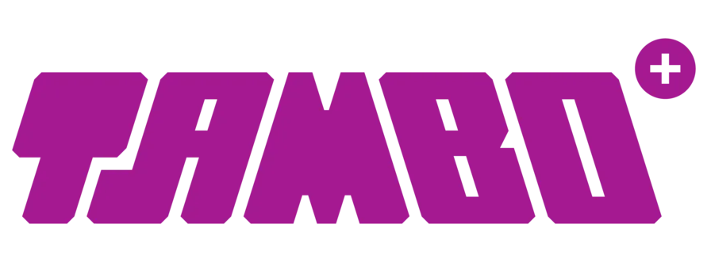

# Proyecto Tiendas Tambo 2025

Este proyecto es una aplicación web desarrollada en React para la gestión y compra de productos en Tiendas Tambo.



---

## Misión

Mejorar la vida de nuestros clientes y trabajadores.

## Visión

Ser la Practi-tienda con mayor número de establecimientos en el país.

---

## Requisitos previos

- **Node.js** versión 20.x (descargar desde [nodejs.org](https://nodejs.org/))
- **npm** (incluido con Node.js)
- **Git** (opcional, para clonar el repositorio)

### ¿Cómo descargar e instalar Node.js?

[](https://nodejs.org/)

- Haz clic en la imagen o visita [nodejs.org](https://nodejs.org/) y descarga la versión recomendada para tu sistema operativo.

#### Video tutorial paso a paso

[](https://www.youtube.com/watch?v=TlB_eWDSMt4)

- Mira este video para instalar Node.js: [https://www.youtube.com/watch?v=TlB_eWDSMt4](https://www.youtube.com/watch?v=TlB_eWDSMt4)

---

## Instalación

1. **Clona el repositorio** (o descarga el código fuente):

   ```sh
   git clone https://github.com/tu-usuario/TAMBO_FRONTEND.git
   cd TAMBO_FRONTEND
   ```

2. **Instala las dependencias**:

   ```sh
   npm install
   ```

---

## Ejecución en modo desarrollo

Para iniciar el servidor de desarrollo y ver la aplicación en tu navegador:

```sh
npm run dev
```

- Abre [http://localhost:5173](http://localhost:5173) (o el puerto que indique la terminal).
- Los cambios en el código se reflejan automáticamente.

---

## Previsualización de la app construida

Puedes probar la versión de producción localmente:

```sh
npm run preview
```

- Abre [http://localhost:4173](http://localhost:4173) (o el puerto que indique la terminal).

---

## Estructura de carpetas principal

- `src/` — Código fuente de la aplicación (componentes, estilos, utilidades)
- `public/` — Archivos estáticos públicos
- `package.json` — Configuración de dependencias y scripts

---

## Notas adicionales

- El backend debe estar disponible en [https://tambo-backend.onrender.com](https://tambo-backend.onrender.com)
- Para cualquier duda, revisa los comentarios en el código fuente.

---


